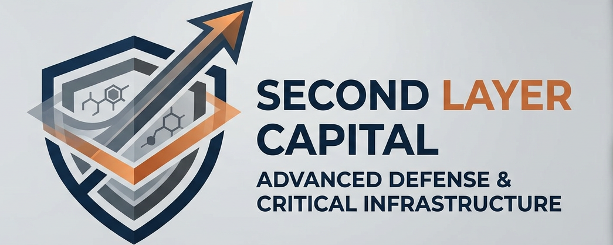

# Second Layer Capital — Hypersonic Defense Screener

A rules-based stock screening and portfolio management system 
targeting the picks-and-shovels supply chain of next-generation 
defense technology — hypersonic weapons, directed energy, 
autonomous systems, and advanced propulsion.

Built by a 21-year U.S. Army veteran (Signal Corps, Infantry, 
Civil Affairs) with a background in cybersecurity and critical 
program protection.

---

## Thesis

The United States and its allies are entering a sustained period 
of next-generation weapons development driven by peer competitor 
threats from China and Russia. The supply chain beneath these 
programs — propulsion manufacturers, advanced materials suppliers, 
guidance systems makers, thermal protection specialists, and systems 
integrators — will see durable, multi-decade government contract 
flow regardless of which specific platforms win.

This screener targets that picks-and-shovels layer, not the prime 
contractors.

---

## Universe

12 actively screened tickers across four technology domains:

- **AI & Autonomy** — PLTR, AVAV, KTOS
- **Hypersonic, Space & Propulsion** — KRMN, HWM, ATI
- **IoMT & Digital Battlefield** — AXON, TDY, HEI, LOAR, CW
- **Industrial Supply Chain** — MTRN

---

## Scoring System

Each ticker receives a composite score (0-100) built from three components:

| Component | Weight | Source |
|-----------|--------|--------|
| Technical | 40% | Price data via yfinance |
| Fundamental | 40% | Revenue growth, margins, D/E via yfinance (cached) |
| Thesis | 20% | Manual alignment score |

Signal thresholds: STRONG ≥75 | NEUTRAL 50-74 | WEAK 25-49 | CRITICAL <25

---

## Rebalancing Rules

- **Shock triggers:** Position >13.5% or <6.5% of portfolio — immediate review
- **Drift triggers:** Position >2% from target for 30 consecutive days — queue for rebalance
- **Cash reserve:** 10% mandatory — never deployed by engine
- **Tier weights:** Disruptor 15% | Standard 10% | Anchor 5% (normalized)

---

## Active Portfolio

Live portfolio managed via Robinhood Agentic account (••••5038).

| Ticker | Tier | Avg Cost |
|--------|------|---------|
| HWM | Standard | $244.82 |
| HEI | Standard | $338.40 |
| LOAR | Standard | $68.98 |
| AXON | Disruptor | $466.13 |
| CW | Standard | $746.50 |
| ATI | Standard | $220.00 |
| KRMN | Disruptor | $54.29 |
| KTOS | Disruptor | $54.31 |
| PLTR | Disruptor | $165.60 |

**Inception:** June 16, 2026 | **Current return:** -6.1% (September 2026 market selloff)

---

## Daily Briefing

The screener runs automatically every weekday at midnight ET via 
GitHub Actions. Daily briefings are saved to `logs/` and readable 
on iPhone via GitHub mobile.

No Streamlit dashboard — we tried, it broke repeatedly, the GitHub 
Actions briefing is more reliable.

---

## Status
🟢 Active — Phase 3 complete, live trading initiated June 2026

---

## Structure
/thesis — Investment thesis and rationale
/universe — Ticker universe and screening criteria
/screener — Scoring, signals, fundamentals, portfolio tracking,
rebalancing engine, intelligence module,
discovery scanner, earnings calendar,
signal/drift history, social media generator
/backtest — Backtesting methodology and results
/data — Cached fundamental data, signal history, drift history
/docs — CHANGELOG, STORY, screener specification
/logs — Daily briefings, intelligence, discovery, rebalance reports
.github — Automated workflows (daily briefing, weekly fundamentals)

---

## Social
- X: [@SecondLayerCap](https://x.com/SecondLayerCap)
- LinkedIn: [Second Layer Capital](https://www.linkedin.com/company/second-layer-capital)

---

## Disclaimer
This project is for personal research and educational purposes only.
Nothing here constitutes financial advice.